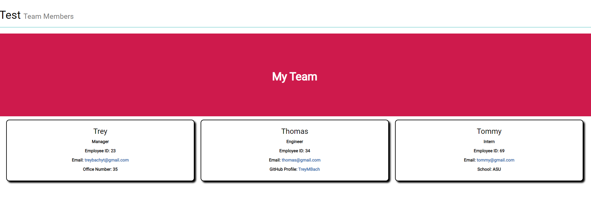

# TeamProfileGenerator
 
    AS A manager

    I WANT to generate a webpage that displays my team's basic info

    SO THAT I have quick access to their emails and GitHub profiles

## Description

To be able to use the command prompt to able to create a manager that is able to add team members.

## Table of Contents 

- [Installation](#installation)
- [Usage](#usage)
- [Credits](#credits)
- [License](#license)
- [Tests](#tests)
- [Questions](#Questions)

## Installation

Inquirer and JEST

## Usage

You would use this application inside the terminal and it would use your inputs to create a html file that is based off those inputs.

Here is a video of me using the application: https://drive.google.com/file/d/1gJv3iLvZXoZreWguI-z3Vz6943IchYRT/view

## Credits

None

## License

This is under the  license.

---

## Tests

Run the tests inside the command line with npm TESTS or the individual test such as Employee.test.js etc.

## Questions

If you would like to contact me for any questions or possible freelance work reach out to me to my links:
- https://github.com/TreyMBach
- https://www.linkedin.com/in/trey-bach-191183200/
- treybachyt@gmail.com

